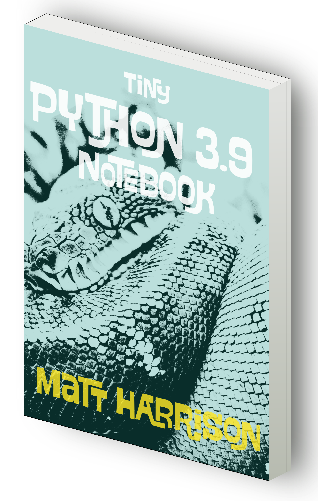

Tiny Python 3.9 Notebook
========================

This repository contains the text for the *Tiny Python 3.9 Notebook*.

Warning, this is not an introduction to Python. Rather it is a notebook
containing curated examples for Python 3 as well as the new features
found in Python 3.9. It is designed to accompany technical corporate
training offered by the author or aid those who want a quick refresher
to the Python syntax.

Reviews
---------

> I love these little books, and have several versions across multiple languages. This is the latest in a series of succinct and up-to-date summaries of the syntax and idioms of Python, and have enough whitespace and notes pages to add useful additional information of snippets of code, lists of tricks etc that you pick up along the way.
>
> I also use these books as a neat little tool to wean me off looking at my phone in idle moments. This book is eminently pocketable and if it's like its siblings it takes a battering as well (witness my ES6 book after nearly three years of riding around in my pocket).
>
> I tend to view it as a pre-populated personal notebook, with enough room for embellishment. The quality of the content and the book itself are excellent. I can't wait to start annotating this one, too! - Amazon 3.8 review

These are for the 3.6 version of this book

> This is an awesome python3 resource I share all the time. 🐍🎉 - @nnja (MS Developer Advocate)

> I think it's pretty awesome. It's all of the syntax boiled down to just the facts man. - Brian Okken (Host of Test & Code podcast)

> It's the perfect follow on to a training course. - Michael Kennedy (Host of Talk Python podcast)

> Great Python reference book by @\_\_mharrison\_\_ "Tiny Python 3.6 Notebook" It's NOT a @ProjectJupyter notebook - @okeedoak

> Goodness! So thankful for @\_\_mharrison\_\_ and his Tiny Python 3.6 Notebook. Great resource! Go get it…  - @\_\_jamesssio\_\_

> Tiny #Python notebook for looking up all the basics. I found this a very concise read if you have some prev prog exp - @andreasose

> Useful collection of notes on Python 3.6 - @hjelmj

> Cool work: a tiny and handy notebook containing notes, tables and examples for Python 3.6. Very much recommended! - @epaillas

> I keep a copy on my desk.  Excellent resource - @HLIBIndustry

> Awesome community work! - @MostafaElzoghbi

> Интересный формат книги по #python - @ku_al

Bulk Purchase
---------------

If you are interested in purchasing larger amounts (100+) for schools, employees or for
use as giveaways/swag at a conference (much better than a tshirt!), get in touch 
with Matt (matt at metasnake dot com).

Thanks
------

If you enjoy this content, consider *purchasing the physical version [on Amazon](https://www.amazon.com/Tiny-Python-3-9-Notebook-Examples/dp/B08L4QWL9H/ref=sr_1_2?crid=QYNIFZ7C3EQE&dchild=1&keywords=tiny+python+notebook&qid=1603324510&sprefix=tiny+python+note%2Caps%2C226&sr=8-2*)
It is a hand laid out version that fits in the pocket and has blank
pages in the back for note taking. Thanks!

Feel free to share this repository on social media.

Errors
------

The author is human and will certainly make errors. You may file a bug
and it may be resolved in a future version of the book. I love feedback
and would love to hear your ideas on what is missing or could be
improved.

License
-------

This content is licensed under the
Attribution-NonCommercial-NoDerivatives 4.0 International (CC BY-NC-ND
4.0)

<https://creativecommons.org/licenses/by-nc-nd/4.0/>
